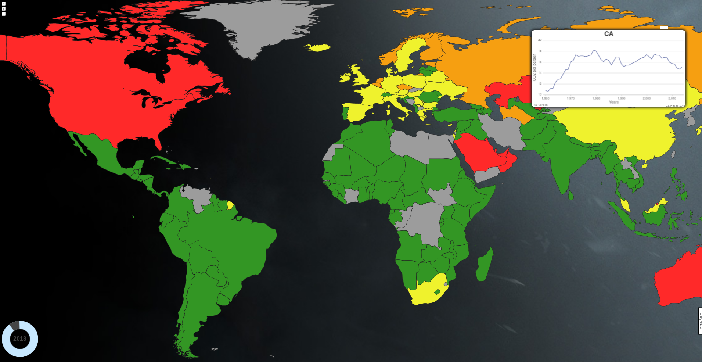
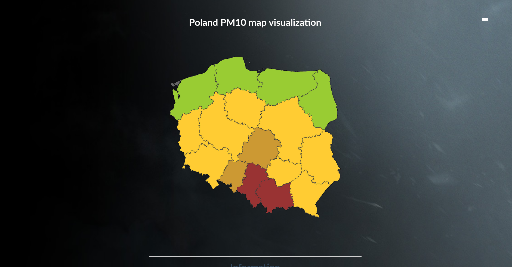
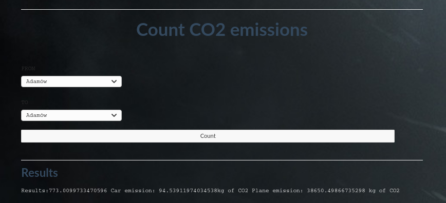
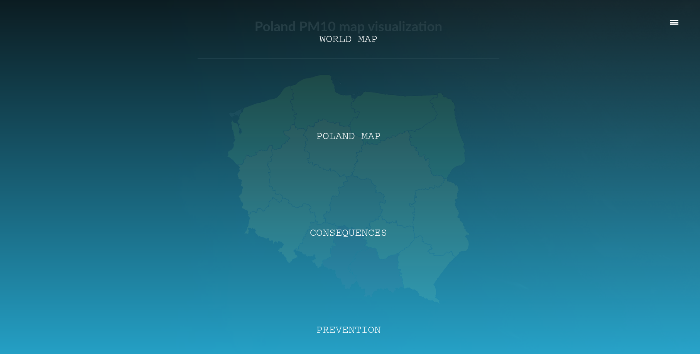

# Air pollution analyzer
## Table of contents

* [Introduction](#Introduction)
* [Launch](#launch)
* [Installation](#installation)
* [General info](#general-info)
* [Code Example](#code-example)
* [TO DO](#to-do)
* [Technologies](#technologies)

## Introduction
Application has been developed as a solution for hackathon organized by BEST HACKS. Subject of this event was air pollution and
greenhouse gas emissions. We decided to create web application that visualizes CO2 emission and PM10 
air content on whole world( by country) and accordingly poland(by voivodeship). Additionally our application provides
graph- statistics for each country. We have also implemented simple CO2 emission calculator to convince people about air pollution arisen by 
a transport choice. To sum up when we have data visualization we can check which country product a lot of CO2 and which
not. We are also able to notice which countries care about global warning by declining tendency of CO2 emission. 
On the other hand as long as we storage from data from past years we can predict next year emission.
## Installation
```
pip install -r /path/to/requirements.txt
```
## Launch
```
python manage.py runserver
```
## General info
Application as in introduction mainly is a visualization of air pollution and global warming culprits. Our dataset storage
co2 emission data from 1960 through 2015. Each Map is interactive/ responsive. By a country click we can see relatively the diagram of 
co2 per person by past years for clicked country. We have implemented an calculator of the CO2 emission as comparison of choosing
one transport over another
### World Map

### Poland Map

### Other
#### Route CO2 emission calculator

#### Navigation bar

## Code Example
Graph drawing on country click with canvasJS.
```python
        elemClick: function (elem) {
            var self = this;
            if (elem === undefined) return;
            if (!self.panning && elem.options.href !== undefined) {
                document.getElementById("graphPanel").classList.add("graph_window_style");
                document.getElementById("graphPanel").style.display="block";
                animateLeft(document.getElementById('graphPanel'), -600, 80);
                let alpha2 = elem.mapElem[0].getAttribute('data-id')
                let graph_values = document.getElementById(alpha2)
                let gv = graph_values.innerText.replaceAll(' ', '').split("],[")
                let X = gv[0].split(',')
                let Y = gv[1].split(',')
                X[0] = X[0].substring(2)
                Y[Y.length - 1] = Y[Y.length - 1].substring(0, Y[Y.length - 1].length - 2)
                let points = []
                for (let i = 0; i < Y.length; i++) {
                    if (Y[i] !== 'nan') {
                        points.push({x: parseInt(X[i]), y: parseFloat(Y[i])})
                    }
                }
                var chart = new CanvasJS.Chart("chartContainer", {
                    animationEnabled: true,
                    axisY: {title: "CO2 per person"},
                    axisX: {title: "Years"},
                    theme: "light2",
                    title: {
                        text: alpha2
                    },
                    data: [{
                        type: "line",
                        indexLabelFontSize: 16,
                        dataPoints: points
                    }]
                });
                chart.render();

                document.getElementById("graphPanel").onclick = function () {
                    this.style.display = "none"

                }

            }
        },
```
## To Do
- next year prediction using AI ( neural network 1-x+-1) using data from past years
## Technologies
 - Python
 - Django
 - CSS
 - HTML
 - Javascript
 - CanvasJS
 - RaphaelJS
 - JQuery
 

